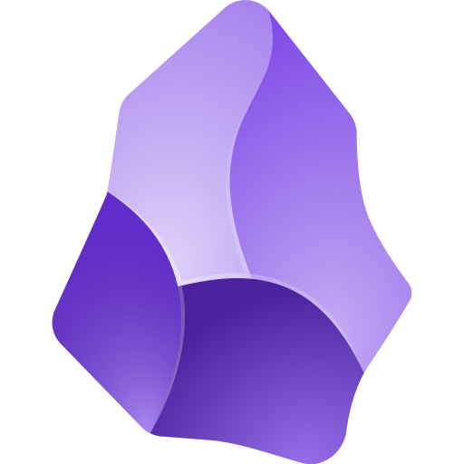
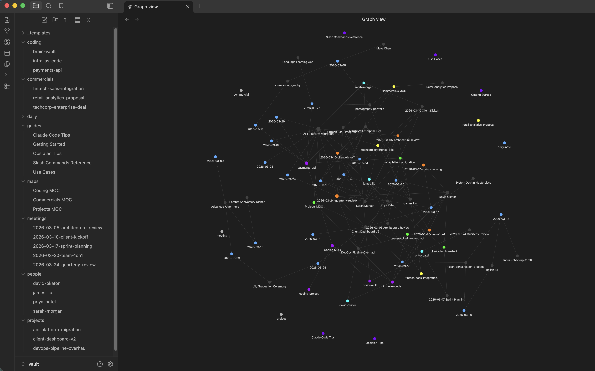
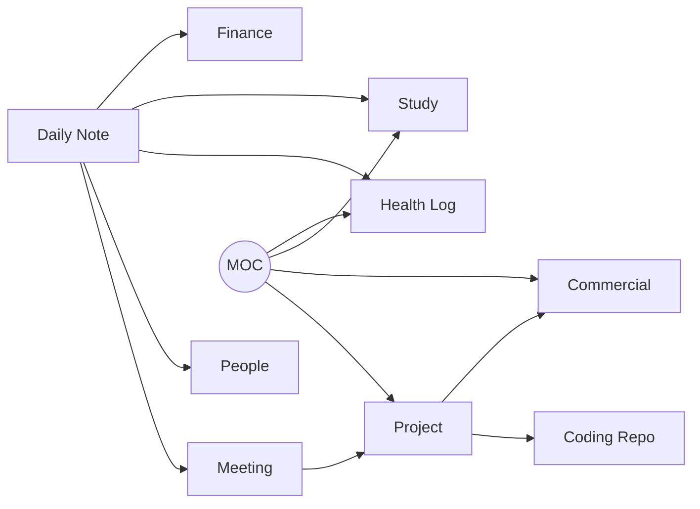
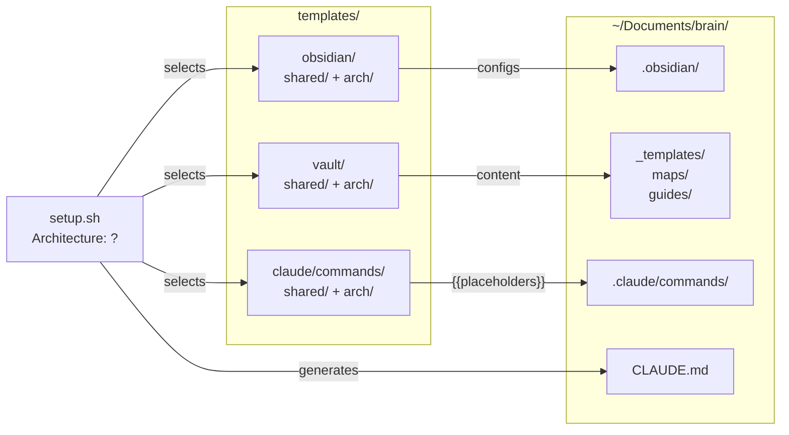

<p align="center">
  
  <span>&nbsp;&nbsp;&nbsp;&nbsp;</span>
  
</p>

<h1 align="center">
  Brain
</h1>

<p align="center">
  <strong>Your second brain, wired for AI.</strong>
</p>

<p align="center">
  Scaffold an <a href="https://obsidian.md">Obsidian</a> vault integrated with <a href="https://claude.ai/code">Claude Code</a> in 30 seconds.<br>
  Choose <strong>Professional</strong>, <strong>Personal</strong>, or <strong>Both</strong> — get a fully-wired vault with daily notes, project tracking, health logging, study management, and more, all connected through wiki-links and powered by up to 26 slash commands.
</p>

<p align="center">
  <a href="LICENSE"></a>
  
  
  <a href="https://obsidian.md"></a>
  <a href="https://claude.ai/code"></a>
</p>

<p align="center">
  <a href="https://github.com/vinipx/brain/stargazers"></a>
  <a href="https://github.com/vinipx/brain/issues"></a>
  
  <a href="https://github.com/vinipx/brain/pulls"></a>
</p>

<!-- Demo recording placeholder — record with vhs, asciinema, or terminalizer -->
<!-- <p align="center">
  
</p> -->

---

## Contents

- [Highlights](#highlights)
- [Quick Start](#quick-start)
- [Demo](#demo)
- [Architecture Modes](#architecture-modes)
- [What You Get](#what-you-get)
- [Slash Commands](#slash-commands)
- [How It Works](#how-it-works)
- [Use Cases](#use-cases)
- [Why Brain?](#why-brain)
- [Customization](#customization)
- [Architecture](#architecture)
- [Contributing](#contributing)
- [License](#license)

---

## Highlights

<table>
  <tr>
    <td align="center" width="33%">
      <h3>Up to 26 Slash Commands</h3>
      Core + thinking partner<br>
      commands that turn your vault<br>
      into an AI-powered second brain
    </td>
    <td align="center" width="33%">
      <h3>Up to 12 Note Templates</h3>
      Daily notes, projects, meetings,<br>study subjects, health logs, finances —<br>all with structured frontmatter
    </td>
    <td align="center" width="33%">
      <h3>Up to 9 Maps of Content</h3>
      Navigate your vault through<br>Projects, Courses, Health, Finance<br>and more — navigation hubs
    </td>
  </tr>
  <tr>
    <td align="center">
      <h3>3 Architecture Modes</h3>
      Professional, Personal, or Both —<br>choose the vault structure<br>that fits your life
    </td>
    <td align="center">
      <h3>Color-Coded Graph</h3>
      Up to 14 colors mapped to folders —<br>see your knowledge network<br>at a glance in Obsidian
    </td>
    <td align="center">
      <h3>Auto-Linked Notes</h3>
      Commands auto-create wiki-links,<br>contact notes, and MOC entries —<br>everything stays connected
    </td>
  </tr>
</table>

---

## Quick Start

### Prerequisites

<a href="https://obsidian.md"></a>
<a href="https://claude.ai/code"></a>

### Install

```bash
git clone https://github.com/vinipx/brain.git
cd brain
./setup.sh
```

The interactive setup prompts for:

| Prompt | Default | Description |
|--------|---------|-------------|
| Architecture | `Professional` | Choose Professional, Personal, or Both |
| Vault name | `brain` | Name for your knowledge base |
| Install directory | `~/Documents/brain` | Where to create the vault |
| Vault folder name | `vault` | Obsidian root folder inside install dir |
| Coding projects dir | *(skip)* | Optional path to your repos (Professional/Both only) |

### After Setup

1. **Open Obsidian** — "Open folder as vault" — select the vault folder
2. **Enable CSS** — Settings > Appearance > CSS snippets > enable `tag-colors`
3. **Start Claude Code** — `cd ~/Documents/brain && claude`
4. **Try it** — type `/daily` to create your first daily note

---

## Demo

See what your vault looks like after 4 weeks of use — before you write a single note yourself.

`demo.sh` populates your vault with realistic synthetic data for a fictional persona (Alex Chen, lead software engineer): 20 daily notes, projects, meetings, people, health logs, finances, and more — all cross-linked with wiki-links to produce a rich Obsidian graph.

```bash
# 1. Run setup first
./setup.sh

# 2. Then populate with demo data
./demo.sh

# Or non-interactively (same args as setup.sh):
./demo.sh ~/Documents/brain vault both
```

The demo script is idempotent — safe to re-run. It skips files that already exist and always refreshes the MOC index notes.

<p align="center">
  
  <br>
  <em>Obsidian graph view after running <code>demo.sh</code> with the Both architecture</em>
</p>

### Quick Access — Shell Alias

Add this to your `~/.zshrc` or `~/.bashrc` to open your Brain vault and start Claude Code with a single command:

```bash
alias brain="cd ~/Documents/brain && claude"
```

Then reload your shell and type `brain` from anywhere:

```bash
source ~/.zshrc   # or ~/.bashrc
brain             # opens Claude Code in your vault directory
```

> **Tip:** Adjust the path to match your install directory if you chose a custom location during setup.

---

## Architecture Modes

Choose the vault structure that fits your needs:

<table>
  <tr>
    <th></th>
    <th align="center">Professional</th>
    <th align="center">Personal</th>
    <th align="center">Both</th>
  </tr>
  <tr>
    <td><strong>Folders</strong></td>
    <td>projects, commercials, coding, meetings, people</td>
    <td>projects, study, courses, finances, health, family, hobby, people</td>
    <td>All of the above</td>
  </tr>
  <tr>
    <td><strong>Templates</strong></td>
    <td>5</td>
    <td>8</td>
    <td>12</td>
  </tr>
  <tr>
    <td><strong>MOCs</strong></td>
    <td>3</td>
    <td>7</td>
    <td>9</td>
  </tr>
  <tr>
    <td><strong>Commands</strong></td>
    <td>19</td>
    <td>22</td>
    <td>26</td>
  </tr>
  <tr>
    <td><strong>Daily Note</strong></td>
    <td>Minimal (Meetings, Tasks, Notes)</td>
    <td>Extended (Health, Tasks, Study, Notes, Gratitude)</td>
    <td>Extended</td>
  </tr>
  <tr>
    <td><strong>Best For</strong></td>
    <td>Consultants, managers, developers tracking work</td>
    <td>Students, self-improvement, life management</td>
    <td>Full life + work integration</td>
  </tr>
</table>

All three modes share: `daily/`, `_templates/`, `maps/`, `guides/`, `.obsidian/`, and the same thinking partner commands (`/trace`, `/connect`, `/ghost`, `/challenge`, `/drift`, `/emerge`).

---

## What You Get

### Professional Vault

```
your-vault/
├── CLAUDE.md                    # Claude Code context (auto-generated)
├── .claude/commands/            # 19 slash commands for Claude Code
└── vault/                       # Obsidian vault root
    ├── _templates/              # 5 note templates (daily, meeting, project, commercial, coding)
    ├── daily/                   # Daily notes (YYYY-MM-DD.md)
    ├── projects/                # Work project tracking
    ├── commercials/             # Commercial engagement tracking
    ├── coding/                  # Lightweight pointers to local code repos
    ├── meetings/                # Standalone meeting notes
    ├── people/                  # Contact/person notes
    ├── maps/                    # 3 MOCs (Projects, Commercials, Coding)
    ├── guides/                  # How-to guides for the system
    └── .obsidian/               # Pre-configured (graph colors, templates, CSS snippets)
```

### Personal Vault

```
your-vault/
├── CLAUDE.md                    # Claude Code context (auto-generated)
├── .claude/commands/            # 22 slash commands for Claude Code
└── vault/                       # Obsidian vault root
    ├── _templates/              # 8 note templates (daily, project, study, course, health, finance, family, hobby)
    ├── daily/                   # Daily notes with Health, Tasks, Study, Gratitude sections
    ├── projects/                # Personal project tracking
    ├── study/                   # School and university subjects
    ├── courses/                 # Online courses and workshops
    ├── finances/                # Budget, expenses, investments
    ├── health/                  # Workouts, appointments, habits
    ├── family/                  # Family events and milestones
    ├── hobby/                   # Hobby projects and activities
    ├── people/                  # Contacts, friends, family members
    ├── maps/                    # 7 MOCs (Projects, Study, Courses, Health, Finance, Family, Hobbies)
    ├── guides/                  # How-to guides for the system
    └── .obsidian/               # Pre-configured (graph colors, templates, CSS snippets)
```

### Both Vault

```
your-vault/
├── CLAUDE.md                    # Claude Code context (auto-generated)
├── .claude/commands/            # 26 slash commands for Claude Code
└── vault/                       # Obsidian vault root
    ├── _templates/              # 12 note templates (all professional + personal)
    ├── daily/                   # Extended daily notes
    ├── projects/                # Work + personal projects
    ├── commercials/             # Commercial engagements
    ├── coding/                  # Code repo references
    ├── meetings/                # Meeting notes
    ├── study/                   # Study subjects
    ├── courses/                 # Online courses
    ├── finances/                # Financial tracking
    ├── health/                  # Health logging
    ├── family/                  # Family events
    ├── hobby/                   # Hobby tracking
    ├── people/                  # All contacts
    ├── maps/                    # 9 MOCs (all navigation hubs)
    ├── guides/                  # How-to guides
    └── .obsidian/               # Pre-configured with all graph colors
```

---

## Slash Commands

All commands run inside Claude Code from the vault's root directory.

### Professional Core Commands

| Command | What It Does | Example |
|---------|-------------|---------|
| `/daily` | Create or open today's daily note | `/daily Sprint planning at 10am` |
| `/add-meeting` | Record a meeting with attendees, decisions, action items | `/add-meeting Q4 Planning with Alice and Bob` |
| `/new-project` | Scaffold a project note, update Projects MOC | `/new-project Dashboard Redesign` |
| `/new-commercial` | Create commercial engagement, auto-create contact notes | `/new-commercial Acme Corp Cloud Migration` |
| `/link-coding` | Create a reference note from a local code repo | `/link-coding payment-service` |
| `/vault-status` | Dashboard: recent activity, active work, open tasks | `/vault-status` |
| `/weekly-review` | Summarize the past 5 work days | `/weekly-review` |

### Personal Core Commands

| Command | What It Does | Example |
|---------|-------------|---------|
| `/daily` | Create or open today's extended daily note | `/daily` |
| `/new-personal-project` | Scaffold a personal project note | `/new-personal-project Portfolio Website` |
| `/new-study` | Create a study subject note, update Study MOC | `/new-study Linear Algebra` |
| `/new-course` | Create a course tracking note, update Courses MOC | `/new-course Machine Learning Specialization` |
| `/log-health` | Log a workout, appointment, or habit | `/log-health Morning run 5K` |
| `/new-finance` | Create a finance tracking note | `/new-finance Monthly budget March` |
| `/new-family-event` | Create a family event note | `/new-family-event Mom's birthday dinner` |
| `/new-hobby` | Create a hobby tracking note | `/new-hobby Watercolor painting` |
| `/vault-status` | Dashboard: recent activity, active items, open tasks | `/vault-status` |
| `/weekly-review` | Summarize the past 7 days | `/weekly-review` |

### Thinking Partner Commands

Available in **all** architecture modes. These commands turn your vault into an active thinking partner — they read your notes, find patterns, and help you think better.

| Command | What It Does | Example |
|---------|-------------|---------|
| `/context` | Load your full state into Claude | `/context` |
| `/today` | Generate a prioritized plan for today | `/today` |
| `/closeday` | End-of-day summary — progress, carry-overs, reflections | `/closeday` |
| `/trace` | Track how an idea evolved over time across your vault | `/trace microservices migration` |
| `/connect` | Find unexpected connections between two topics | `/connect machine learning and client onboarding` |
| `/ghost` | Answer a question in your voice, based on your writing | `/ghost Should we adopt Kubernetes?` |
| `/challenge` | Pressure-test your beliefs — find contradictions and weak points | `/challenge our pricing strategy` |
| `/ideas` | Generate ideas grounded in your patterns | `/ideas` |
| `/graduate` | Promote undeveloped ideas from daily notes into standalone files | `/graduate` |
| `/drift` | Surface recurring themes you might not be aware of | `/drift` |
| `/emerge` | Find idea clusters coalescing into potential projects | `/emerge` |
| `/schedule` | Suggest a weekly schedule aligned with your priorities | `/schedule` |

---

## How It Works

### Notes Connect Through Wiki-Links



Every note has YAML frontmatter with `type` and `tags` fields. Claude Code reads `CLAUDE.md` to understand the vault structure and conventions.

### Maps of Content (MOC)

Index notes in `maps/` serve as navigation hubs:

**Professional:** Projects MOC, Commercials MOC, Coding MOC

**Personal:** Projects MOC, Study MOC, Courses MOC, Health MOC, Finance MOC, Family MOC, Hobbies MOC

**Both:** All 9 MOCs combined

### Coding Project References

Notes in `coding/` are lightweight pointers (~20 tokens each) with a `repo-path` field. Claude only reads the actual repository when you ask a specific question, keeping token usage minimal. *(Professional and Both modes only)*

### Graph View

The Obsidian graph is color-coded by folder:

**Professional graph:**

| Color | Folder |
|-------|--------|
|  | `daily/` |
|  | `projects/` |
|  | `commercials/` |
|  | `coding/` |
|  | `maps/` |
|  | `meetings/` |
|  | `people/` |
|  | `guides/` |

**Personal graph** adds:

| Color | Folder |
|-------|--------|
|  | `study/` |
|  | `courses/` |
|  | `health/` |
|  | `finances/` |
|  | `family/` |
|  | `hobby/` |

---

## Use Cases

Real-world workflows for getting the most out of Brain in your daily personal and professional life.

### Daily Workflow

<details>
<summary><strong>1. Morning Planning</strong> — Start every day with clarity</summary>

```
/daily
/today
```

First, `/daily` creates today's note. Then `/today` reads your recent notes, active projects, and upcoming commitments to generate a **prioritized plan**.

**Professional example:**

```
## Today's Plan — Wednesday, March 28, 2026

### Must Do
- [ ] Send Acme proposal — deadline is today
- [ ] Review PR for payment-service — blocking release

### Should Do
- [ ] Dashboard Redesign: finalize mockups
- [ ] Follow up with Jane on Cloud Migration timeline

### Carry-Over from Previous Days
- [ ] Update CI/CD pipeline docs (from [[2026-03-26]])
```

**Personal example:**

```
## Today's Plan — Wednesday, March 28, 2026

### Must Do
- [ ] Linear Algebra assignment due tomorrow — finish Chapter 5 exercises
- [ ] Morning run (5K training plan, Week 3)

### Should Do
- [ ] Continue Machine Learning course — Module 4
- [ ] Review monthly budget — rent due Friday

### Personal
- [ ] Mom's birthday dinner prep — buy gift
- [ ] Practice watercolor — landscape exercise
```

**Value:** No more staring at a blank screen wondering what to do. `/today` turns your vault into a prioritized task list grounded in what's actually happening across work and life.

</details>

<details>
<summary><strong>2. Back-to-Back Meeting Day</strong> — Rapid capture between calls</summary>

Between meetings, fire off quick captures:

```
/add-meeting Sprint Planning
> attendees: Alice, Bob, Carlos
> Decided to delay release by 1 week
> Action: Bob updates the timeline by Friday

/add-meeting Client Sync with Acme
> Jane from Acme. Happy with progress.
> Need to send updated SOW by end of week
> Action: prepare SOW draft tomorrow
```

Each command records attendees, decisions, and action items. Meetings are auto-linked to your daily note and any referenced projects.

At the end of the day:

```
/closeday
```

Claude reviews what happened, summarizes progress, surfaces unfinished tasks as carry-overs for tomorrow, and adds an **End of Day** section to your daily note with reflections.

**Value:** You never lose meeting outcomes. `/closeday` wraps up the day cleanly so you can start fresh tomorrow.

</details>

<details>
<summary><strong>3. Full Day Bookends</strong> — /context + /today in the morning, /closeday at night</summary>

**Morning:**

```
/context
```

Claude loads your full state: active projects, current studies, health habits, upcoming family events — everything. You're oriented in 30 seconds.

```
/today
```

Claude builds your prioritized plan based on everything it just loaded.

**Evening:**

```
/closeday
```

Claude captures progress, new ideas, and carry-overs. Your daily note is complete.

**Value:** Three commands frame your entire day. No context is lost between sessions.

</details>

### Professional

<details>
<summary><strong>4. New Client Engagement</strong> — From opportunity to project delivery</summary>

A new opportunity comes in:

```
/new-commercial Acme Corp Cloud Migration
```

This creates:
- `commercials/acme-corp-cloud-migration.md` with client, timeline, value fields
- `people/jane-doe.md` for the client contact
- An entry in the **Commercials MOC**

Track discovery calls and negotiations:

```
/add-meeting Acme Discovery Call
> Discussed requirements: migrate 3 services to AWS
> Budget: $150K, timeline: Q2
> Next: send proposal by Friday
```

When the deal closes, transition to delivery:

```
/new-project Acme Corp Implementation
> Link to commercial: [[Acme Corp Cloud Migration]]
> Update commercial status to "won"
```

**Value:** Full lifecycle tracking from first contact to project completion. No context is lost in the handoff from sales to delivery.

</details>

<details>
<summary><strong>5. Onboarding to a New Codebase</strong> — Token-efficient deep dives</summary>

Picking up an unfamiliar repo:

```
/link-coding payment-service
```

Claude scans the repo, reads `README.md`, `package.json`, or `Cargo.toml`, and creates a lightweight reference note with language, framework, and key files.

Now ask questions naturally:

```
"What's the architecture of payment-service?"
"Where are the API routes defined?"
"How does authentication work in this project?"
```

Claude follows the `repo-path` in the reference note and reads the actual source code — only when you ask. The reference note itself costs ~20 tokens.

**Value:** Build a catalog of every repo you touch. Each one is a lightweight pointer until you need depth, keeping your vault fast and token usage low.

</details>

<details>
<summary><strong>6. Weekly Reporting</strong> — Automated summary from your daily notes</summary>

At the end of the week:

```
/weekly-review
```

Claude reads the last 5 daily notes and generates a `YYYY-WNN-review.md` with:
- **Meetings attended** and key decisions
- **Tasks completed** vs. tasks still open
- **Project and commercial activity**
- **Reflections** section for your own notes

Use the output directly in status emails, standup summaries, or 1:1 prep.

**Value:** No more Friday afternoon scramble to remember what you did. The review writes itself from structured data you already captured.

</details>

<details>
<summary><strong>7. Preparing for a 1:1 or Client Call</strong> — AI-powered briefings</summary>

Before a meeting, ask Claude naturally:

```
"Summarize all activity on [[Dashboard Redesign]] in the last 2 weeks"
"What decisions were made in meetings related to [[Acme Corp]]?"
"List all open action items assigned to me"
"What commercials are currently active and what's their last update?"
```

Or load everything at once:

```
/context
```

Claude traverses wiki-links across daily notes, meeting records, and project logs to assemble a comprehensive briefing.

**Value:** Walk into every meeting prepared. Claude does the homework — you just ask the question.

</details>

<details>
<summary><strong>8. Quarter-End Review & Handoff</strong> — Aggregate and transition</summary>

**Quarter review:**

```
"Summarize all weekly reviews from January through March"
"List all projects that moved to completed this quarter"
"Show the timeline of all commercial engagements in Q1"
"Count meetings by project for this quarter"
```

**Project handoff:**

```
"Generate a handoff document for [[Dashboard Redesign]] including:
 - Project overview and current status
 - All meeting decisions
 - Open tasks and blockers
 - Related commercial history
 - Linked coding repos and their purpose"
```

**Value:** Structured frontmatter across all notes means Claude can aggregate, filter, and analyze your entire quarter — or build a complete handoff package in seconds.

</details>

<details>
<summary><strong>9. Weekly Planning</strong> — Align your time with your priorities</summary>

```
/schedule
```

Claude reads your active projects, commercials, recent daily notes, and weekly reviews, then generates a **day-by-day schedule** with focus blocks and time budgets:

```
### Priority Alignment Check
- Stated priorities: Dashboard Redesign, Acme onboarding
- Actual time spent: 60% meetings, 25% Acme, 15% Dashboard
- Misalignment: Dashboard is your #1 priority but getting the least time

### Tuesday
- Focus block: Dashboard Redesign mockups (3 hours)
- Tasks: Review Acme SOW, prep for Wednesday standup
```

It also flags conflicts between what you say matters and how you're actually spending time.

**Value:** Your calendar reflects your priorities, not just your meetings.

</details>

### Personal

<details>
<summary><strong>10. University Semester Management</strong> — Track subjects, assignments, and grades</summary>

At the start of a semester:

```
/new-study Linear Algebra
> Institution: MIT, Semester: Spring 2026
> Schedule: MWF 10am

/new-study Data Structures
> Institution: MIT, Semester: Spring 2026
> Schedule: TTh 2pm
```

Each study note tracks: schedule, assignments (with checklist), grades (with weights), and resources. The **Study MOC** organizes everything by current/completed/subject.

Track your progress in daily notes:

```
/daily
> Studied Linear Algebra chapter 5 — eigenvalues make more sense now
> Data Structures: finished binary tree assignment, submitted early
```

Before exams, ask Claude:

```
"What are all my open assignments across all subjects?"
"Summarize my Linear Algebra notes from the last 3 weeks"
"What grade do I need on the final to get an A in Data Structures?"
```

**Value:** One place for everything academic. Never miss an assignment, track grades automatically, and use `/weekly-review` to see how you're spending study time.

</details>

<details>
<summary><strong>11. Online Course Progress</strong> — Self-paced learning with accountability</summary>

```
/new-course Machine Learning Specialization
> Platform: Coursera, Instructor: Andrew Ng
> URL: coursera.org/ml-specialization
```

The course note tracks modules (with checkboxes), progress percentage, notes per module, and certificate status.

As you work through modules:

```
/daily
> ML Course: Completed Module 4 — neural networks basics
> Key insight: backpropagation is just chain rule applied recursively
```

Use `/drift` to see what topics across courses you keep returning to. Use `/graduate` to promote course insights into standalone project ideas.

**Value:** Self-paced courses have a 90%+ dropout rate. Brain keeps you accountable with visible progress tracking and AI that reminds you what's next.

</details>

<details>
<summary><strong>12. Fitness & Health Tracking</strong> — Workouts, habits, and appointments</summary>

Log different types of health entries:

```
/log-health Morning run — 5K in 28:30, felt strong
/log-health Annual physical — Dr. Smith, blood work ordered
/log-health Meditation — 15 min morning session, day 12 streak
```

Each log captures category (workout/appointment/habit), measurements, and notes. The **Health MOC** organizes by Fitness, Medical, Habits, and By Month.

Ask Claude to spot patterns:

```
"How has my running pace changed over the last month?"
"Show me my habit streaks — which ones am I maintaining?"
"When is my next medical appointment?"
```

Use `/weekly-review` to see your health activity summary alongside study and project progress:

```
### Health This Week
- Runs: 3 (Mon 5K, Wed 8K, Sat 10K) — total 23K
- Meditation: 6/7 days — streak at 18 days
- Sleep average: 7.2 hours (up from 6.8 last week)
```

**Value:** Health data lives alongside the rest of your life. `/drift` might reveal that your best study days correlate with morning runs.

</details>

<details>
<summary><strong>13. Household Budget & Finance Tracking</strong> — Budget, save, invest</summary>

```
/new-finance Monthly Budget March 2026
> Category: budget, Amount: $3,500

/new-finance Emergency Fund
> Category: investment, Amount: $10,000, Recurring: true
```

Track expenses in daily notes:

```
/daily
> Groceries: $85 at Trader Joe's
> Electric bill: $120 — higher than usual, check thermostat
```

The **Finance MOC** organizes by Budget, Investments, Expenses, and Goals.

Ask Claude for insights:

```
"What's my total spending this month vs. budget?"
"Show my recurring expenses — what can I cut?"
"How is my emergency fund tracking toward the $15K goal?"
```

**Value:** Simple financial awareness without a separate app. The data is in your vault, and Claude can analyze patterns across months.

</details>

<details>
<summary><strong>14. Family Event Planning</strong> — Birthdays, gatherings, milestones</summary>

```
/new-family-event Mom's 60th Birthday
> Date: 2026-04-15, Participants: Mom, Dad, siblings
> Restaurant reservation needed, gift ideas: garden tools, cooking class

/new-family-event Summer Vacation Planning
> Date: 2026-07-01, Participants: whole family
> Research: beach house rentals, flight costs
```

The **Family MOC** shows upcoming events, birthdays, and family notes.

Use `/schedule` to block time for family alongside work or study:

```
### Saturday
- Morning: Family errands + grocery shopping
- Afternoon: Mom's birthday gift shopping
- Evening: Family dinner at home
```

**Value:** Family commitments don't get buried under work. They're first-class items in your vault with the same tracking and reminders as everything else.

</details>

<details>
<summary><strong>15. Hobby Project Tracking</strong> — From casual interest to skilled practice</summary>

```
/new-hobby Watercolor Painting
> Started March 2026, following YouTube tutorials
```

Track progress in daily notes and the hobby note's progress log:

```
/daily
> Watercolor: practiced wet-on-wet technique for 45 min
> Getting better at color mixing — the sunset exercise turned out well
```

Use `/trace` to follow your skill development:

```
/trace watercolor
```

Claude shows how your practice evolved: first attempts, breakthroughs, techniques learned, and where you're headed.

Use `/emerge` to see when hobby interests are clustering into something bigger — maybe watercolor + travel notes are converging into a travel sketchbook project.

**Value:** Hobbies get the same structured tracking as work projects. You can see your progress arc, and AI helps you notice when casual interests are becoming serious pursuits.

</details>

<details>
<summary><strong>16. Personal Project Management</strong> — Side projects with real tracking</summary>

```
/new-personal-project Portfolio Website
> Priority: high, Target: end of April
```

Unlike professional projects, personal project notes skip client/commercial fields and focus on goals, tasks, and progress. Track in daily notes:

```
/daily
> Portfolio: designed the homepage layout in Figma
> Next: build the responsive grid with CSS Grid

/daily
> Portfolio: homepage is responsive, started the projects page
> Blocked: need to resize all project screenshots
```

Use `/challenge` to stress-test your approach:

```
/challenge my portfolio design choices
```

Claude reviews your notes and questions your decisions — "You mention responsive design but your screenshots aren't optimized. Your timeline assumes 2 hours/day but daily notes show you're averaging 45 minutes."

**Value:** Personal projects get real project management. No more half-finished side projects — Brain tracks what you're doing and keeps you honest.

</details>

### Thinking Partner

<details>
<summary><strong>17. Trace an Idea's Evolution</strong> — See the arc of your thinking</summary>

An idea keeps coming up and you want to understand why:

```
/trace microservices migration
```

Claude searches your entire vault chronologically and shows how the idea evolved:

```
## Trace: Microservices Migration

First mention: 2026-01-15 in [[2026-01-15]]
> "Wondering if we should break up the monolith"

2026-02-03 — [[Sprint Planning Meeting]] (meeting)
> Team discussed migration risks, decided to prototype first

2026-02-28 — [[Dashboard Redesign]] (project)
> "Blocked by monolith — this is another reason to migrate"

Most recent: 2026-03-25 in [[2026-03-25]]
> "Microservices migration feels inevitable now"

Evolution: Started as speculation → became a team discussion → now blocking other work
```

Works across all domains — trace a study topic, a health goal, or a hobby interest with equal depth.

**Value:** See patterns in your own thinking that you'd never notice by browsing notes. Understand *why* an idea keeps returning.

</details>

<details>
<summary><strong>18. Connect the Dots</strong> — Find unexpected bridges between topics</summary>

You suspect two areas of your life are related but can't see how:

```
/connect morning exercise and study performance
```

Claude searches both topics, follows wiki-links, and finds the bridges:

```
## Connections: Morning Exercise ↔ Study Performance

### Evidence
- Daily notes with morning runs show 40% more "productive" tags
- Your best Linear Algebra scores came after workout mornings
- Health logs and study notes share the tag "focused"

### Unexpected Patterns
- You never study past 9pm on workout days — exercise gives you enough
  focus that evening cramming becomes unnecessary
```

Works for professional connections too:

```
/connect machine learning and client onboarding
```

**Value:** Your vault knows things you don't. `/connect` surfaces non-obvious relationships across your knowledge — work and personal.

</details>

<details>
<summary><strong>19. Ghost-Write in Your Voice</strong> — Externalize your own thinking</summary>

Need to draft something that sounds like you:

```
/ghost Should we adopt Kubernetes for the new platform?
```

Claude reads your vault — your writing style, stated opinions, past decisions — and drafts a response in your voice:

```
Based on your vault, here's how you'd answer:

"We should adopt Kubernetes, but not yet. Our team is still ramping up on
containerization basics, and adding orchestration complexity now would slow
us down. I'd rather nail Docker Compose first, then migrate when we have
3+ services that need independent scaling..."

Sources:
- [[2026-02-15]] — "Don't add complexity before we need it"
- [[Platform Rewrite]] — Decision to start simple and evolve
```

Also works for personal decisions:

```
/ghost Should I switch from running to swimming for cardio?
```

**Value:** Externalize your thinking without starting from scratch. Great for drafting emails, proposals, position papers, or personal decisions.

</details>

<details>
<summary><strong>20. Pressure-Test Your Beliefs</strong> — Find your blind spots</summary>

Before making a big decision:

```
/challenge our pricing strategy
```

Claude catalogs your positions, then systematically challenges them:

```
### Contradictions Found
- In [[Q1 Review]] you said "we need to move upmarket" but in [[Acme Corp]]
  you're discounting 30% to close — these conflict

### Weak Points
- You assume enterprise clients value support over price, but your vault
  has no evidence for this — it's untested

### Devil's Advocate
Your pricing assumes a 40% margin, but three of your last five commercials
required custom work that wasn't scoped. Your effective margin might be
closer to 20%...
```

Works for personal beliefs too:

```
/challenge my study strategy
```

Claude might find: "You say spaced repetition works best for you, but your daily notes show you cram the night before every exam. Your grades on cramming vs. spaced-repetition tests differ by 12 points."

**Value:** Stress-test your thinking before committing. Better to find contradictions yourself than have reality find them for you.

</details>

<details>
<summary><strong>21. Generate Ideas from Your Patterns</strong> — Grounded brainstorming</summary>

```
/ideas
```

Claude scans your last 21 days of notes and generates ideas grounded in your actual patterns.

**Professional ideas:**

```
### Tools to Build
1. Data Quality Dashboard — you mention "data issues" in 8 notes across
   3 projects. A shared validation tool would save you hours.

### People to Reach Out To
1. [[Jane Doe]] — you haven't talked in 3 weeks but she's key to the
   Acme timeline. Schedule a check-in.
```

**Personal ideas:**

```
### Skills to Learn
1. Data Visualization — appears in both your ML course notes and your
   watercolor hobby. Combine them into a creative coding project.

### Health Goals
1. You've mentioned "sleep" in 6 daily notes but have no tracking.
   Start a sleep habit log to correlate with study performance.

### Hobby Projects
1. Travel Sketchbook — your watercolor practice + upcoming family vacation
   = perfect opportunity to start a travel art journal.
```

**Value:** Every idea traces back to something you actually wrote or did. No generic suggestions — just patterns you haven't noticed yet.

</details>

<details>
<summary><strong>22. Graduate Ideas into Projects</strong> — Promote half-formed thoughts</summary>

Your daily notes are full of scattered ideas that deserve more space:

```
/graduate
```

Claude scans the last 14 days and finds ideas worth promoting:

```
## Ideas Ready to Graduate

### 1. Internal CLI Toolkit
- First appeared: [[2026-03-15]] — "We keep writing the same bash scripts"
- Also mentioned: [[2026-03-18]], [[2026-03-22]]
- Core claim: A shared CLI toolkit would standardize team workflows
- Maturity: Ready to develop

### 2. Meal Prep System
- First appeared: [[2026-03-10]] — "Spending too much on takeout"
- Also mentioned: [[2026-03-14]], [[2026-03-20]]
- Core claim: Weekly meal prep would save money and be healthier
- Maturity: Ready to plan
```

Approve the ones you want, and Claude creates standalone notes with context, connections, and open questions — then updates the relevant MOC.

**Value:** Ideas stop dying in daily notes. The best ones get promoted into real work with full context preserved.

</details>

<details>
<summary><strong>23. Surface What You're Drifting Toward</strong> — See your subconscious patterns</summary>

```
/drift
```

Claude looks for themes that keep appearing across unrelated contexts:

**Professional drift:**

```
### Strong Drift: "Developer Experience"
- Appearances: 9 notes across 4 contexts
- Trend: increasing
- Found in:
  - [[Dashboard Redesign]] — "DX of the API is terrible"
  - [[2026-03-20]] — "Spent 2 hours on tooling setup"
  - [[Acme Corp]] — "Client devs struggling with our SDK"
- Interpretation: You're circling toward developer experience as a
  priority even when the task is about something else entirely
```

**Personal drift:**

```
### Strong Drift: "Creative Coding"
- Appearances: 6 notes across 3 contexts
- Trend: emerging
- Found in:
  - [[ML Course]] — "The visualization exercises are my favorite part"
  - [[Watercolor Painting]] — "Want to try generative art"
  - [[2026-03-22]] — "Spent 2 hours on a Processing sketch instead of studying"
- Interpretation: You're drawn to the intersection of code and art.
  Consider making this an explicit hobby or project.
```

**Value:** Name the thing you've been thinking about before you realize it. `/drift` makes the invisible visible.

</details>

<details>
<summary><strong>24. Find What's Emerging</strong> — Scattered thoughts becoming real</summary>

```
/emerge
```

Claude maps wiki-links and themes to find clusters ready to become projects:

```
### Ready to Launch
1. "API Developer Portal"
   - Core idea: Unified docs + SDK + examples for external developers
   - Evidence: 7 connected notes across projects, commercials, and meetings
   - Momentum: accelerating — mentioned in 4 of last 5 daily notes
   - Suggested next step: Create a project note and schedule a kickoff

### Forming
1. "Health & Productivity System"
   - Notes involved: [[Morning Run Log]], [[Study Performance]], [[Sleep Notes]]
   - Pattern: Exercise → better focus → better grades
   - Needs: Formalize into a tracked habit system with correlations
```

**Value:** Ideas that are ready to become real get surfaced before they lose momentum. You don't have to remember what's clustering — Claude tracks it for you.

</details>

### Work-Life Integration (Both Mode)

<details>
<summary><strong>25. Cross-Domain Context Loading</strong> — See your full picture</summary>

With the **Both** architecture, `/context` scans everything:

```
/context
```

```
## Your Current Context

### Work
- Active Projects: Dashboard Redesign (high priority), Acme Implementation
- Active Commercials: Beta Corp proposal pending
- Coding: payment-service (PR review needed)

### Personal
- Study: Linear Algebra midterm next week, Data Structures assignment due Thursday
- Health: Running streak at 12 days, meditation streak at 18
- Finance: March budget tracking — $2,100 of $3,500 spent
- Family: Mom's birthday dinner Saturday

### Cross-Domain
- You mentioned "feeling stretched" in 3 of last 5 daily notes
- Work meetings increased 40% this week — cutting into study time
- Suggested: Block Wednesday afternoon for Linear Algebra exam prep
```

**Value:** One command shows your entire life. Cross-domain insights (like work eating into study time) only emerge when everything is in one vault.

</details>

<details>
<summary><strong>26. Weekly Life Review</strong> — Work, personal, everything in one summary</summary>

```
/weekly-review
```

In **Both** mode, the weekly review covers all domains:

```
## Week 13 Review — March 23-29, 2026

### Work
- Meetings: 8 (up from 5 last week)
- Projects: Dashboard mockups approved, Acme SOW sent
- Commercials: Beta Corp moved to active

### Study & Learning
- Linear Algebra: 6 hours, completed Chapter 5
- ML Course: Module 4 finished (65% overall progress)

### Health
- Runs: 3 sessions, 23K total
- Meditation: 6/7 days
- Energy level: high Mon-Wed, dipped Thu-Fri

### Finance
- Spent: $2,800 of $3,500 budget
- Notable: Electric bill spike, eating out 3x

### Family & Personal
- Mom's birthday dinner — went well
- Watercolor: 2 sessions, started landscape series

### Work-Life Balance
- Work hours: ~45 (above target of 40)
- Study hours: 8 (below target of 10)
- Recommendation: Reduce Thursday meetings to protect study blocks
```

**Value:** See your whole week — not just work or personal, but the balance between them. The review surfaces conflicts and helps you adjust.

</details>

<details>
<summary><strong>27. Balanced Scheduling</strong> — Work + life in one calendar</summary>

```
/schedule
```

In **Both** mode, scheduling integrates all domains:

```
### Monday
- 9:00-12:00 — Focus: Dashboard Redesign (work)
- 12:00-13:00 — Lunch + walk
- 13:00-14:00 — Acme standup (work)
- 14:00-16:00 — Linear Algebra study block
- 16:30-17:30 — Running (5K training)
- 19:00-20:00 — ML Course Module 5

### Priority Alignment
- Work priorities getting 55% of time (target: 50%) ✓
- Study getting 20% (target: 25%) — slightly under
- Health getting 10% (target: 10%) ✓
- Family: Saturday fully blocked for Mom's birthday ✓
```

**Value:** Your schedule reflects everything — not just meetings. Study, health, and family get protected time blocks alongside work commitments.

</details>

### Personal (Extended)

<details>
<summary><strong>28. Learning a Musical Instrument</strong> — Structured practice with progress tracking</summary>

```
/new-hobby Piano
> Started January 2026, using Simply Piano app + YouTube
```

Log practice sessions:

```
/daily
> Piano: 30 min — Clair de Lune, measures 1-16
> Left hand crossover is getting smoother
> Need to slow down on the arpeggio section
```

Use `/trace piano` after a few months to see your entire learning arc. Use `/drift` to see if music practice is becoming a significant part of your life. Use `/connect piano and stress` to see if practice sessions correlate with better mood in daily notes.

**Value:** Visible progress on something that usually feels invisible. Three months of logged sessions tells a story that memory alone can't.

</details>

<details>
<summary><strong>29. Health Appointment Management</strong> — Never lose medical context</summary>

```
/log-health Annual physical with Dr. Smith
> Category: appointment
> Blood pressure: 120/80, weight: 170
> Blood work ordered — results in 1 week
> Follow-up: schedule dermatology referral

/log-health Blood work results
> Category: appointment
> Cholesterol: 195 (borderline), vitamin D low
> Action: start vitamin D supplement, recheck in 6 months
```

Before your next appointment:

```
"Summarize all my medical appointments and their outcomes"
"What follow-ups am I overdue on?"
```

**Value:** Walk into every doctor's appointment with your full medical history in context. No more "I think my cholesterol was... something?"

</details>

<details>
<summary><strong>30. Travel & Vacation Planning</strong> — From idea to itinerary</summary>

```
/new-family-event Summer Trip to Portugal
> Date: 2026-07-15, Participants: family
> Research: flights, Lisbon Airbnb, Algarve beach houses

/new-finance Summer Trip Budget
> Category: budget, Amount: $5,000
```

Track research in daily notes:

```
/daily
> Portugal trip: found Lisbon Airbnb for $120/night, 4.9 rating
> Booked flights: $800 round trip per person
> Todo: research Sintra day trip, Porto train tickets
```

Use `/connect portugal and food` to surface restaurant recommendations from your notes. Use `/schedule` to block out prep time before the trip.

**Value:** Travel planning scattered across browser tabs, spreadsheets, and group chats comes together in one place with budget tracking alongside.

</details>

---

## Why Brain?

| | Manual Setup | Brain |
|---|---|---|
| **Vault structure** | Design from scratch | Pre-built, tested, up to 14 folders |
| **Architecture choice** | One size fits all | Professional, Personal, or Both |
| **Claude Code integration** | Write your own CLAUDE.md | Auto-generated with your paths |
| **Slash commands** | None | Up to 26 ready-to-use commands |
| **Graph colors** | Manual JSON editing | Pre-configured, up to 14 color groups |
| **Cross-linking** | Remember to link manually | Commands auto-link notes + MOCs |
| **Note templates** | Create your own | Up to 12 structured templates included |
| **Setup time** | Hours | 30 seconds |

---

## Customization

<details>
<summary><strong>Adding Note Templates</strong></summary>

Add `.md` files to `vault/_templates/`. Use Obsidian's `{{date}}` and `{{title}}` placeholders.

</details>

<details>
<summary><strong>Adding Slash Commands</strong></summary>

Add `.md` files to `.claude/commands/`. Use YAML frontmatter for `description` and `allowed-tools`. See existing commands for the pattern.

</details>

<details>
<summary><strong>CSS Snippets</strong></summary>

Add `.css` files to `vault/.obsidian/snippets/`. Enable them in Obsidian Settings > Appearance > CSS snippets.

</details>

---

## Architecture



Templates are organized into `shared/`, `professional/`, `personal/`, and `both/` subdirectories. During setup, `setup.sh` copies shared files plus the architecture-specific files, substitutes placeholders (`{{VAULT_FOLDER}}`, `{{CODING_DIR}}`), and generates a `CLAUDE.md` tailored to the chosen architecture.

---

## Contributing

Contributions are welcome! Here's how:

1. **Fork** the repository
2. **Create** a feature branch — `git checkout -b feature/amazing-feature`
3. **Test** your changes — run `./setup.sh` for each architecture and verify the output
4. **Commit** your changes — `git commit -m 'Add amazing feature'`
5. **Push** to the branch — `git push origin feature/amazing-feature`
6. **Open** a Pull Request

### Ideas for Contributions

- New slash commands (e.g., `/retrospective`, `/goal-tracker`, `/standup`)
- Additional note templates for new life domains
- A fourth architecture mode (e.g., Academic, Creative)
- Obsidian community plugin integration guides
- CSS snippet themes (dark mode, minimal, colorful)
- Windows/WSL support
- Setup script localization

---

## License

[MIT](LICENSE)

---

<p align="center">
  <a href="https://obsidian.md"></a>
  &nbsp;
  <a href="https://claude.ai/code"></a>
</p>

<p align="center">
  <a href="https://obsidian.md"></a>
  <a href="https://claude.ai/code"></a>
  
</p>

<p align="center">
  Made by <a href="https://github.com/vinipx">vinipx</a>
</p>
