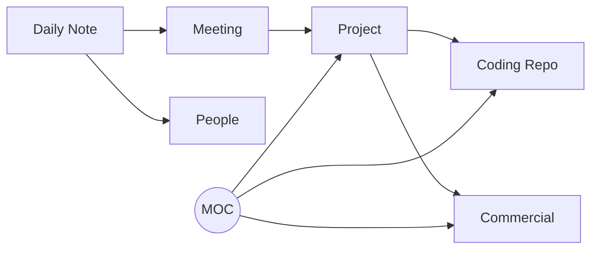
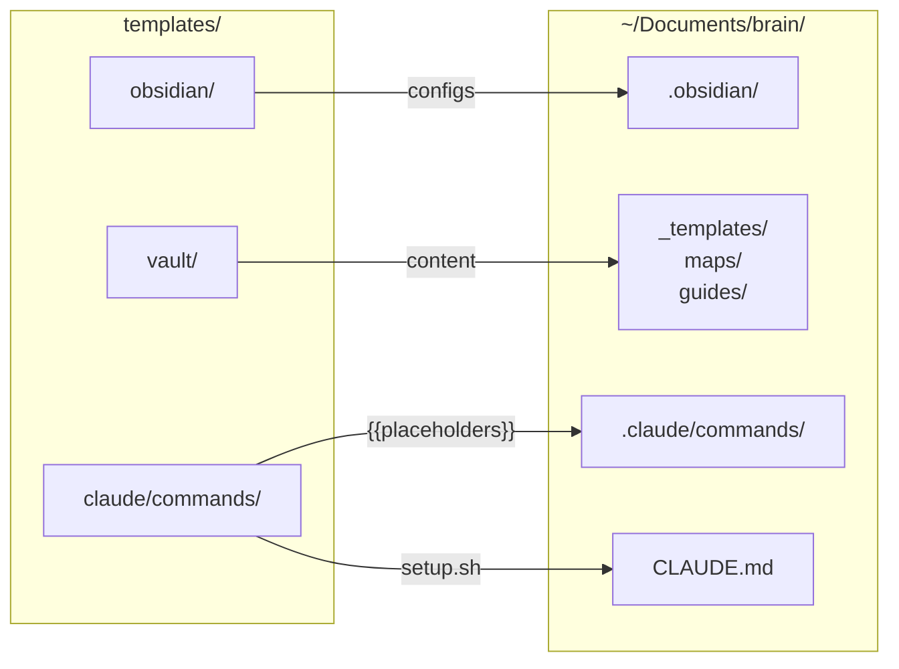

<h1 align="center">
  Brain
</h1>

<p align="center">
  <strong>Your second brain, wired for AI.</strong>
</p>

<p align="center">
  Scaffold an Obsidian vault integrated with Claude Code in 30 seconds.<br>
  Daily notes, project tracking, commercial management, coding references — all connected through wiki-links and powered by 19 slash commands.
</p>

<p align="center">
  <a href="LICENSE"></a>
  
  
  <a href="https://obsidian.md"></a>
  <a href="https://claude.ai/code"></a>
</p>

<p align="center">
  <a href="https://github.com/vinipx/brain/stargazers"></a>
  <a href="https://github.com/vinipx/brain/issues"></a>
  
  <a href="https://github.com/vinipx/brain/pulls"></a>
</p>

<!-- Demo recording placeholder — record with vhs, asciinema, or terminalizer -->
<!-- <p align="center">
  
</p> -->

---

## Contents

- [Highlights](#highlights)
- [Quick Start](#quick-start)
- [What You Get](#what-you-get)
- [Slash Commands](#slash-commands)
- [How It Works](#how-it-works)
- [Use Cases](#use-cases)
- [Why Brain?](#why-brain)
- [Customization](#customization)
- [Architecture](#architecture)
- [Contributing](#contributing)
- [License](#license)

---

## Highlights

<table>
  <tr>
    <td align="center" width="33%">
      <h3>19 Slash Commands</h3>
      7 core + 12 thinking partner<br>
      commands that turn your vault<br>
      into an AI-powered second brain
    </td>
    <td align="center" width="33%">
      <h3>5 Note Templates</h3>
      Daily notes, meetings, projects,<br>commercials, and coding references —<br>all with structured frontmatter
    </td>
    <td align="center" width="33%">
      <h3>3 Maps of Content</h3>
      Navigate your vault through<br>Projects, Commercials, and Coding<br>index hubs
    </td>
  </tr>
  <tr>
    <td align="center">
      <h3>Color-Coded Graph</h3>
      7 colors mapped to folders —<br>see your knowledge network<br>at a glance in Obsidian
    </td>
    <td align="center">
      <h3>Token-Efficient</h3>
      Coding refs cost ~20 tokens each.<br>Claude reads actual repos only<br>when you ask specific questions
    </td>
    <td align="center">
      <h3>Auto-Linked Notes</h3>
      Commands auto-create wiki-links,<br>person notes, and MOC entries —<br>everything stays connected
    </td>
  </tr>
</table>

---

## Quick Start

### Prerequisites

<a href="https://obsidian.md"></a>
<a href="https://claude.ai/code"></a>

### Install

```bash
git clone https://github.com/vinipx/brain.git
cd brain
./setup.sh
```

The interactive setup prompts for:

| Prompt | Default | Description |
|--------|---------|-------------|
| Vault name | `brain` | Name for your knowledge base |
| Install directory | `~/Documents/brain` | Where to create the vault |
| Vault folder name | `vault` | Obsidian root folder inside install dir |
| Coding projects dir | *(skip)* | Optional path to your coding repos |

### After Setup

1. **Open Obsidian** — "Open folder as vault" — select the vault folder
2. **Enable CSS** — Settings > Appearance > CSS snippets > enable `tag-colors`
3. **Start Claude Code** — `cd ~/Documents/brain && claude`
4. **Try it** — type `/daily` to create your first daily note

---

## What You Get

```
your-vault/
├── CLAUDE.md                    # Claude Code context (auto-generated)
├── .claude/commands/            # 19 slash commands for Claude Code
└── vault/                       # Obsidian vault root
    ├── _templates/              # 5 note templates (daily, meeting, project, commercial, coding)
    ├── daily/                   # Daily notes (YYYY-MM-DD.md)
    ├── projects/                # Work project tracking
    ├── commercials/             # Commercial engagement tracking
    ├── coding/                  # Lightweight pointers to local code repos
    ├── meetings/                # Standalone meeting notes
    ├── people/                  # Contact/person notes
    ├── maps/                    # Map of Content index notes (navigation hubs)
    ├── guides/                  # How-to guides for the system
    └── .obsidian/               # Pre-configured (graph colors, templates, CSS snippets)
```

---

## Slash Commands

All commands run inside Claude Code from the vault's root directory.

### Core Commands

| Command | What It Does | Example |
|---------|-------------|---------|
| `/daily` | Create or open today's daily note | `/daily Sprint planning at 10am` |
| `/add-meeting` | Record a meeting with attendees, decisions, action items | `/add-meeting Q4 Planning with Alice and Bob` |
| `/new-project` | Scaffold a project note, update Projects MOC | `/new-project Dashboard Redesign` |
| `/new-commercial` | Create commercial engagement, auto-create contact notes | `/new-commercial Acme Corp Cloud Migration` |
| `/link-coding` | Create a reference note from a local code repo | `/link-coding payment-service` |
| `/vault-status` | Dashboard: recent activity, active work, open tasks | `/vault-status` |
| `/weekly-review` | Summarize the past 5 work days | `/weekly-review` |

### Thinking Partner Commands

These commands turn your vault into an active thinking partner — they read your notes, find patterns, and help you think better.

| Command | What It Does | Example |
|---------|-------------|---------|
| `/context` | Load your full life and work state into Claude | `/context` |
| `/today` | Generate a prioritized plan for today | `/today` |
| `/closeday` | End-of-day summary — progress, carry-overs, reflections | `/closeday` |
| `/trace` | Track how an idea evolved over time across your vault | `/trace microservices migration` |
| `/connect` | Find unexpected connections between two topics | `/connect machine learning and client onboarding` |
| `/ghost` | Answer a question in your voice, based on your writing | `/ghost Should we adopt Kubernetes?` |
| `/challenge` | Pressure-test your beliefs — find contradictions and weak points | `/challenge our pricing strategy` |
| `/ideas` | Generate ideas: tools to build, people to meet, topics to explore | `/ideas` |
| `/graduate` | Promote undeveloped ideas from daily notes into standalone files | `/graduate` |
| `/drift` | Surface recurring themes you might not be aware of | `/drift` |
| `/emerge` | Find idea clusters coalescing into potential projects | `/emerge` |
| `/schedule` | Suggest a weekly schedule aligned with your priorities | `/schedule` |

---

## How It Works

### Notes Connect Through Wiki-Links



Every note has YAML frontmatter with `type` and `tags` fields. Claude Code reads `CLAUDE.md` to understand the vault structure and conventions.

### Maps of Content (MOC)

Three index notes in `maps/` serve as navigation hubs:
- **Projects MOC** — Active, On Hold, Completed projects
- **Commercials MOC** — Active, Won, Lost engagements
- **Coding MOC** — References to local repositories

### Coding Project References

Notes in `coding/` are lightweight pointers (~20 tokens each) with a `repo-path` field. Claude only reads the actual repository when you ask a specific question, keeping token usage minimal.

### Graph View

The Obsidian graph is color-coded by folder:

| Color | Folder |
|-------|--------|
|  | `daily/` |
|  | `projects/` |
|  | `commercials/` |
|  | `coding/` |
|  | `maps/` |
|  | `meetings/` |
|  | `people/` |
|  | `guides/` |

---

## Use Cases

Real-world workflows for getting the most out of Brain in your daily personal and professional life.

### Daily Workflow

<details>
<summary><strong>1. Morning Planning</strong> — Start every day with clarity</summary>

```
/daily
/today
```

First, `/daily` creates today's note with **Meetings**, **Tasks**, and **Notes** sections. Then `/today` reads your recent daily notes, active projects, and commercials to generate a **prioritized plan**:

```
## Today's Plan — Wednesday, March 28, 2026

### Must Do
- [ ] Send Acme proposal — deadline is today
- [ ] Review PR for payment-service — blocking release

### Should Do
- [ ] Dashboard Redesign: finalize mockups
- [ ] Follow up with Jane on Cloud Migration timeline

### Carry-Over from Previous Days
- [ ] Update CI/CD pipeline docs (from [[2026-03-26]])
```

**Value:** No more staring at a blank screen wondering what to do. `/today` turns your vault into a prioritized task list grounded in what's actually happening.

</details>

<details>
<summary><strong>2. Back-to-Back Meeting Day</strong> — Rapid capture between calls</summary>

Between meetings, fire off quick captures:

```
/add-meeting Sprint Planning
> attendees: Alice, Bob, Carlos
> Decided to delay release by 1 week
> Action: Bob updates the timeline by Friday

/add-meeting Client Sync with Acme
> Jane from Acme. Happy with progress.
> Need to send updated SOW by end of week
> Action: prepare SOW draft tomorrow
```

Each command records attendees, decisions, and action items. Meetings are auto-linked to your daily note and any referenced projects.

At the end of the day:

```
/closeday
```

Claude reviews what happened, summarizes progress, surfaces unfinished tasks as carry-overs for tomorrow, and adds an **End of Day** section to your daily note with reflections.

**Value:** You never lose meeting outcomes. `/closeday` wraps up the day cleanly so you can start fresh tomorrow.

</details>

<details>
<summary><strong>3. Full Day Bookends</strong> — /context + /today in the morning, /closeday at night</summary>

**Morning:**

```
/context
```

Claude loads your full state: active projects, commercials, recent focus areas, key people. You're oriented in 30 seconds.

```
/today
```

Claude builds your prioritized plan based on everything it just loaded.

**Evening:**

```
/closeday
```

Claude captures progress, new ideas, and carry-overs. Your daily note is complete.

**Value:** Three commands frame your entire day. No context is lost between sessions.

</details>

### Professional

<details>
<summary><strong>4. New Client Engagement</strong> — From opportunity to project delivery</summary>

A new opportunity comes in:

```
/new-commercial Acme Corp Cloud Migration
```

This creates:
- `commercials/acme-corp-cloud-migration.md` with client, timeline, value fields
- `people/jane-doe.md` for the client contact
- An entry in the **Commercials MOC**

Track discovery calls and negotiations:

```
/add-meeting Acme Discovery Call
> Discussed requirements: migrate 3 services to AWS
> Budget: $150K, timeline: Q2
> Next: send proposal by Friday
```

When the deal closes, transition to delivery:

```
/new-project Acme Corp Implementation
> Link to commercial: [[Acme Corp Cloud Migration]]
> Update commercial status to "won"
```

**Value:** Full lifecycle tracking from first contact to project completion. No context is lost in the handoff from sales to delivery.

</details>

<details>
<summary><strong>5. Onboarding to a New Codebase</strong> — Token-efficient deep dives</summary>

Picking up an unfamiliar repo:

```
/link-coding payment-service
```

Claude scans the repo, reads `README.md`, `package.json`, or `Cargo.toml`, and creates a lightweight reference note with language, framework, and key files.

Now ask questions naturally:

```
"What's the architecture of payment-service?"
"Where are the API routes defined?"
"How does authentication work in this project?"
```

Claude follows the `repo-path` in the reference note and reads the actual source code — only when you ask. The reference note itself costs ~20 tokens.

**Value:** Build a catalog of every repo you touch. Each one is a lightweight pointer until you need depth, keeping your vault fast and token usage low.

</details>

<details>
<summary><strong>6. Weekly Reporting</strong> — Automated summary from your daily notes</summary>

At the end of the week:

```
/weekly-review
```

Claude reads the last 5 daily notes and generates a `YYYY-WNN-review.md` with:
- **Meetings attended** and key decisions
- **Tasks completed** vs. tasks still open
- **Project and commercial activity**
- **Reflections** section for your own notes

Use the output directly in status emails, standup summaries, or 1:1 prep.

**Value:** No more Friday afternoon scramble to remember what you did. The review writes itself from structured data you already captured.

</details>

<details>
<summary><strong>7. Preparing for a 1:1 or Client Call</strong> — AI-powered briefings</summary>

Before a meeting, ask Claude naturally:

```
"Summarize all activity on [[Dashboard Redesign]] in the last 2 weeks"
"What decisions were made in meetings related to [[Acme Corp]]?"
"List all open action items assigned to me"
"What commercials are currently active and what's their last update?"
```

Or load everything at once:

```
/context
```

Claude traverses wiki-links across daily notes, meeting records, and project logs to assemble a comprehensive briefing.

**Value:** Walk into every meeting prepared. Claude does the homework — you just ask the question.

</details>

<details>
<summary><strong>8. Quarter-End Review & Handoff</strong> — Aggregate and transition</summary>

**Quarter review:**

```
"Summarize all weekly reviews from January through March"
"List all projects that moved to completed this quarter"
"Show the timeline of all commercial engagements in Q1"
"Count meetings by project for this quarter"
```

**Project handoff:**

```
"Generate a handoff document for [[Dashboard Redesign]] including:
 - Project overview and current status
 - All meeting decisions
 - Open tasks and blockers
 - Related commercial history
 - Linked coding repos and their purpose"
```

**Value:** Structured frontmatter across all notes means Claude can aggregate, filter, and analyze your entire quarter — or build a complete handoff package in seconds.

</details>

<details>
<summary><strong>9. Weekly Planning</strong> — Align your time with your priorities</summary>

```
/schedule
```

Claude reads your active projects, commercials, recent daily notes, and weekly reviews, then generates a **day-by-day schedule** with focus blocks and time budgets:

```
### Priority Alignment Check
- Stated priorities: Dashboard Redesign, Acme onboarding
- Actual time spent: 60% meetings, 25% Acme, 15% Dashboard
- Misalignment: Dashboard is your #1 priority but getting the least time

### Tuesday
- Focus block: Dashboard Redesign mockups (3 hours)
- Tasks: Review Acme SOW, prep for Wednesday standup
```

It also flags conflicts between what you say matters and how you're actually spending time.

**Value:** Your calendar reflects your priorities, not just your meetings.

</details>

### Thinking Partner

<details>
<summary><strong>10. Trace an Idea's Evolution</strong> — See the arc of your thinking</summary>

An idea keeps coming up and you want to understand why:

```
/trace microservices migration
```

Claude searches your entire vault chronologically and shows how the idea evolved:

```
## Trace: Microservices Migration

First mention: 2026-01-15 in [[2026-01-15]]
> "Wondering if we should break up the monolith"

2026-02-03 — [[Sprint Planning Meeting]] (meeting)
> Team discussed migration risks, decided to prototype first

2026-02-28 — [[Dashboard Redesign]] (project)
> "Blocked by monolith — this is another reason to migrate"

Most recent: 2026-03-25 in [[2026-03-25]]
> "Microservices migration feels inevitable now"

Evolution: Started as speculation → became a team discussion → now blocking other work
```

**Value:** See patterns in your own thinking that you'd never notice by browsing notes. Understand *why* an idea keeps returning.

</details>

<details>
<summary><strong>11. Connect the Dots</strong> — Find unexpected bridges between topics</summary>

You suspect two areas of your work are related but can't see how:

```
/connect machine learning and client onboarding
```

Claude searches both topics, follows wiki-links, and finds the bridges:

```
## Connections: Machine Learning ↔ Client Onboarding

### Bridge Notes
- [[Acme Corp Implementation]] → [[data-pipeline]] → [[ML Model Training]]
  Acme's onboarding includes a data pipeline that feeds the ML model

### Shared Context
- People: [[Jane Doe]] appears in both domains
- Theme: Both involve "data quality" as a recurring concern

### Unexpected Patterns
- Your ML notes mention "clean data" 7 times; your onboarding notes mention "data validation" 5 times — same problem, different language
```

**Value:** Your vault knows things you don't. `/connect` surfaces non-obvious relationships across your knowledge.

</details>

<details>
<summary><strong>12. Ghost-Write in Your Voice</strong> — Externalize your own thinking</summary>

Need to draft something that sounds like you:

```
/ghost Should we adopt Kubernetes for the new platform?
```

Claude reads your vault — your writing style, stated opinions, past decisions — and drafts a response in your voice:

```
Based on your vault, here's how you'd answer:

"We should adopt Kubernetes, but not yet. Our team is still ramping up on
containerization basics, and adding orchestration complexity now would slow
us down. I'd rather nail Docker Compose first, then migrate when we have
3+ services that need independent scaling..."

Sources:
- [[2026-02-15]] — "Don't add complexity before we need it"
- [[Platform Rewrite]] — Decision to start simple and evolve
```

**Value:** Externalize your thinking without starting from scratch. Great for drafting emails, proposals, or position papers.

</details>

<details>
<summary><strong>13. Pressure-Test Your Beliefs</strong> — Find your blind spots</summary>

Before making a big decision:

```
/challenge our pricing strategy
```

Claude catalogs your positions, then systematically challenges them:

```
### Contradictions Found
- In [[Q1 Review]] you said "we need to move upmarket" but in [[Acme Corp]]
  you're discounting 30% to close — these conflict

### Weak Points
- You assume enterprise clients value support over price, but your vault
  has no evidence for this — it's untested

### Devil's Advocate
Your pricing assumes a 40% margin, but three of your last five commercials
required custom work that wasn't scoped. Your effective margin might be
closer to 20%...
```

**Value:** Stress-test your thinking before committing. Better to find contradictions yourself than have a client find them.

</details>

<details>
<summary><strong>14. Generate Ideas from Your Patterns</strong> — Grounded brainstorming</summary>

```
/ideas
```

Claude scans your last 21 days of notes and generates ideas across four categories:

```
### Tools to Build
1. Data Quality Dashboard — you mention "data issues" in 8 notes across
   3 projects. A shared validation tool would save you hours.

### People to Reach Out To
1. [[Jane Doe]] — you haven't talked in 3 weeks but she's key to the
   Acme timeline. Schedule a check-in.

### Topics to Investigate
1. Event-driven architecture — keeps appearing in your coding notes
   and meeting discussions. Ready for a deep dive.

### Things to Write
1. "Why We Chose Incremental Migration" — you have 12 notes with strong
   opinions on this. Blog post writes itself.
```

**Value:** Every idea traces back to something you actually wrote or did. No generic suggestions — just patterns you haven't noticed yet.

</details>

<details>
<summary><strong>15. Graduate Ideas into Projects</strong> — Promote half-formed thoughts</summary>

Your daily notes are full of scattered ideas that deserve more space:

```
/graduate
```

Claude scans the last 14 days and finds ideas worth promoting:

```
## Ideas Ready to Graduate

### 1. Internal CLI Toolkit
- First appeared: [[2026-03-15]] — "We keep writing the same bash scripts"
- Also mentioned: [[2026-03-18]], [[2026-03-22]]
- Core claim: A shared CLI toolkit would standardize team workflows
- Maturity: Ready to develop
```

Approve the ones you want, and Claude creates standalone project notes with context, connections, and open questions — then updates the Projects MOC.

**Value:** Ideas stop dying in daily notes. The best ones get promoted into real work with full context preserved.

</details>

<details>
<summary><strong>16. Surface What You're Drifting Toward</strong> — See your subconscious patterns</summary>

```
/drift
```

Claude looks for themes that keep appearing across unrelated contexts:

```
## Drift Report

### Strong Drift: "Developer Experience"
- Appearances: 9 notes across 4 contexts
- Trend: increasing
- Found in:
  - [[Dashboard Redesign]] — "DX of the API is terrible"
  - [[2026-03-20]] — "Spent 2 hours on tooling setup"
  - [[Acme Corp]] — "Client devs struggling with our SDK"
- Interpretation: You're circling toward developer experience as a
  priority even when the task is about something else entirely
```

**Value:** Name the thing you've been thinking about before you realize it. `/drift` makes the invisible visible.

</details>

<details>
<summary><strong>17. Find What's Emerging</strong> — Scattered thoughts becoming real</summary>

```
/emerge
```

Claude maps wiki-links and themes to find clusters ready to become projects:

```
### Ready to Launch
1. "API Developer Portal"
   - Core idea: Unified docs + SDK + examples for external developers
   - Evidence: 7 connected notes across projects, commercials, and meetings
   - Momentum: accelerating — mentioned in 4 of last 5 daily notes
   - Suggested next step: Create a project note and schedule a kickoff

### Forming
1. "Team Knowledge Base"
   - Notes involved: [[Onboarding Guide]], [[CLI Toolkit]], [[Code Standards]]
   - Needs: A conversation with the team about scope
```

**Value:** Ideas that are ready to become real get surfaced before they lose momentum. You don't have to remember what's clustering — Claude tracks it for you.

</details>

### Personal

<details>
<summary><strong>18. Learning Journal</strong> — Track what you learn, see patterns emerge</summary>

Use `/daily` to log what you learned each day:

```
/daily
> Learned about Rust lifetimes from the Rustlings exercises
> Read chapter 4 of Designing Data-Intensive Applications
> TIL: PostgreSQL supports JSON path queries natively
```

Link to coding projects you're studying:

```
/link-coding rustlings
```

Then use `/drift` to see what topics you're gravitating toward, and `/trace` to follow how your understanding of a topic evolved over weeks.

**Value:** Turn scattered learning into a visible trajectory. Combine with `/drift` to see what your curiosity is actually pulling you toward.

</details>

<details>
<summary><strong>19. Side Project Tracker</strong> — From idea to shipped</summary>

Start a side project:

```
/new-project Personal Portfolio Site
/link-coding portfolio-repo
```

Track progress in daily notes. When you feel stuck:

```
/connect portfolio and career goals
```

Claude finds how your side project connects to your professional growth, stated goals, and skills you're developing.

Use `/emerge` to see when scattered side-project ideas are ready to merge into something bigger.

**Value:** Side projects don't get lost. The thinking partner commands help you see *why* a project matters, not just *what* to do next.

</details>

<details>
<summary><strong>20. Goal Setting & Accountability</strong> — Quarterly goals that stick</summary>

Create a project note for each quarterly goal:

```
/new-project Q2 Goal: Launch Blog
/new-project Q2 Goal: Run 100 Miles
/new-project Q2 Goal: Learn Kubernetes
```

Reference goals in daily notes as you work on them. Then use the thinking partner commands to stay on track:

```
/schedule          → See if your time matches your stated priorities
/challenge my Q2 goals  → Find which goals are realistic and which are wishful thinking
/ghost What would I tell someone pursuing these same goals?
```

The weekly review surfaces which goals got attention and which were neglected. The **Projects MOC** provides a dashboard view of all goals.

**Value:** Goals are tracked through actual work, reinforced by AI that challenges, schedules, and holds you accountable.

</details>

---

## Why Brain?

| | Manual Setup | Brain |
|---|---|---|
| **Vault structure** | Design from scratch | Pre-built, tested, 9 folders |
| **Claude Code integration** | Write your own CLAUDE.md | Auto-generated with your paths |
| **Slash commands** | None | 19 ready-to-use commands |
| **Graph colors** | Manual JSON editing | Pre-configured, 8 color groups |
| **Cross-linking** | Remember to link manually | Commands auto-link notes + MOCs |
| **Note templates** | Create your own | 5 structured templates included |
| **Setup time** | Hours | 30 seconds |

---

## Customization

<details>
<summary><strong>Adding Note Templates</strong></summary>

Add `.md` files to `vault/_templates/`. Use Obsidian's `{{date}}` and `{{title}}` placeholders.

</details>

<details>
<summary><strong>Adding Slash Commands</strong></summary>

Add `.md` files to `.claude/commands/`. Use YAML frontmatter for `description` and `allowed-tools`. See existing commands for the pattern.

</details>

<details>
<summary><strong>CSS Snippets</strong></summary>

Add `.css` files to `vault/.obsidian/snippets/`. Enable them in Obsidian Settings > Appearance > CSS snippets.

</details>

---

## Architecture



Placeholders (`{{VAULT_FOLDER}}`, `{{CODING_DIR}}`) in command templates are substituted with your values during setup. A `CLAUDE.md` is generated with your specific vault paths and conventions.

---

## Contributing

Contributions are welcome! Here's how:

1. **Fork** the repository
2. **Create** a feature branch — `git checkout -b feature/amazing-feature`
3. **Test** your changes — run `./setup.sh` and verify the output end-to-end
4. **Commit** your changes — `git commit -m 'Add amazing feature'`
5. **Push** to the branch — `git push origin feature/amazing-feature`
6. **Open** a Pull Request

### Ideas for Contributions

- New slash commands (e.g., `/retrospective`, `/goal-tracker`, `/standup`)
- Additional note templates
- Obsidian community plugin integration guides
- CSS snippet themes (dark mode, minimal, colorful)
- Windows/WSL support
- Setup script localization

---

## License

[MIT](LICENSE)

---

<p align="center">
  <a href="https://obsidian.md"></a>
  <a href="https://claude.ai/code"></a>
  
</p>

<p align="center">
  Made by <a href="https://github.com/vinipx">vinipx</a>
</p>
