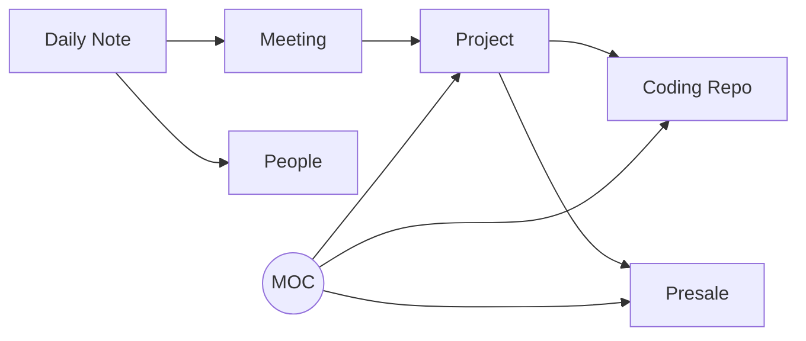
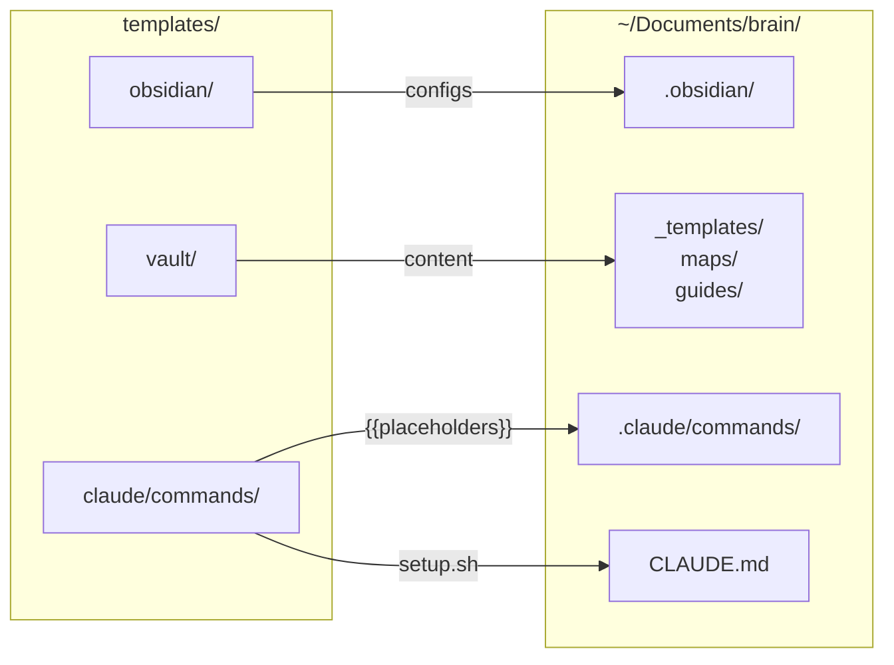

<h1 align="center">
  Brain
</h1>

<p align="center">
  <strong>Your second brain, wired for AI.</strong>
</p>

<p align="center">
  Scaffold an Obsidian vault integrated with Claude Code in 30 seconds.<br>
  Daily notes, project tracking, presale management, coding references — all connected through wiki-links and powered by 7 slash commands.
</p>

<p align="center">
  <a href="LICENSE"></a>
  
  
  <a href="https://obsidian.md"></a>
  <a href="https://claude.ai/code"></a>
</p>

<p align="center">
  <a href="https://github.com/vinipx/brain/stargazers"></a>
  <a href="https://github.com/vinipx/brain/issues"></a>
  
  <a href="https://github.com/vinipx/brain/pulls"></a>
</p>

<!-- Demo recording placeholder — record with vhs, asciinema, or terminalizer -->
<!-- <p align="center">
  
</p> -->

---

## Contents

- [Highlights](#highlights)
- [Quick Start](#quick-start)
- [What You Get](#what-you-get)
- [Slash Commands](#slash-commands)
- [How It Works](#how-it-works)
- [Use Cases](#use-cases)
- [Why Brain?](#why-brain)
- [Customization](#customization)
- [Architecture](#architecture)
- [Contributing](#contributing)
- [License](#license)

---

## Highlights

<table>
  <tr>
    <td align="center" width="33%">
      <h3>7 Slash Commands</h3>
      <code>/daily</code> <code>/add-meeting</code> <code>/new-project</code><br>
      <code>/new-presale</code> <code>/link-coding</code> <code>/vault-status</code><br>
      <code>/weekly-review</code>
    </td>
    <td align="center" width="33%">
      <h3>5 Note Templates</h3>
      Daily notes, meetings, projects,<br>presales, and coding references —<br>all with structured frontmatter
    </td>
    <td align="center" width="33%">
      <h3>3 Maps of Content</h3>
      Navigate your vault through<br>Projects, Presales, and Coding<br>index hubs
    </td>
  </tr>
  <tr>
    <td align="center">
      <h3>Color-Coded Graph</h3>
      7 colors mapped to folders —<br>see your knowledge network<br>at a glance in Obsidian
    </td>
    <td align="center">
      <h3>Token-Efficient</h3>
      Coding refs cost ~20 tokens each.<br>Claude reads actual repos only<br>when you ask specific questions
    </td>
    <td align="center">
      <h3>Auto-Linked Notes</h3>
      Commands auto-create wiki-links,<br>person notes, and MOC entries —<br>everything stays connected
    </td>
  </tr>
</table>

---

## Quick Start

### Prerequisites

<a href="https://obsidian.md"></a>
<a href="https://claude.ai/code"></a>

### Install

```bash
git clone https://github.com/vinipx/brain.git
cd brain
./setup.sh
```

The interactive setup prompts for:

| Prompt | Default | Description |
|--------|---------|-------------|
| Vault name | `brain` | Name for your knowledge base |
| Install directory | `~/Documents/brain` | Where to create the vault |
| Vault folder name | `vault` | Obsidian root folder inside install dir |
| Coding projects dir | *(skip)* | Optional path to your coding repos |

### After Setup

1. **Open Obsidian** — "Open folder as vault" — select the vault folder
2. **Enable CSS** — Settings > Appearance > CSS snippets > enable `tag-colors`
3. **Start Claude Code** — `cd ~/Documents/brain && claude`
4. **Try it** — type `/daily` to create your first daily note

---

## What You Get

```
your-vault/
├── CLAUDE.md                    # Claude Code context (auto-generated)
├── .claude/commands/            # 7 slash commands for Claude Code
└── vault/                       # Obsidian vault root
    ├── _templates/              # 5 note templates (daily, meeting, project, presale, coding)
    ├── daily/                   # Daily notes (YYYY-MM-DD.md)
    ├── projects/                # Work project tracking
    ├── presales/                # Presale engagement tracking
    ├── coding/                  # Lightweight pointers to local code repos
    ├── meetings/                # Standalone meeting notes
    ├── people/                  # Contact/person notes
    ├── maps/                    # Map of Content index notes (navigation hubs)
    ├── guides/                  # How-to guides for the system
    └── .obsidian/               # Pre-configured (graph colors, templates, CSS snippets)
```

---

## Slash Commands

All commands run inside Claude Code from the vault's root directory.

| Command | What It Does | Example |
|---------|-------------|---------|
| `/daily` | Create or open today's daily note | `/daily` or `/daily Sprint planning at 10am` |
| `/add-meeting` | Record a meeting with attendees, decisions, action items | `/add-meeting Q4 Planning with Alice and Bob` |
| `/new-project` | Scaffold a project note, update Projects MOC | `/new-project Dashboard Redesign` |
| `/new-presale` | Create presale engagement, auto-create contact notes | `/new-presale Acme Corp Cloud Migration` |
| `/link-coding` | Create a reference note from a local code repo | `/link-coding payment-service` |
| `/vault-status` | Dashboard: recent activity, active work, open tasks | `/vault-status` |
| `/weekly-review` | Summarize the past 5 work days | `/weekly-review` |

---

## How It Works

### Notes Connect Through Wiki-Links



Every note has YAML frontmatter with `type` and `tags` fields. Claude Code reads `CLAUDE.md` to understand the vault structure and conventions.

### Maps of Content (MOC)

Three index notes in `maps/` serve as navigation hubs:
- **Projects MOC** — Active, On Hold, Completed projects
- **Presales MOC** — Active, Won, Lost engagements
- **Coding MOC** — References to local repositories

### Coding Project References

Notes in `coding/` are lightweight pointers (~20 tokens each) with a `repo-path` field. Claude only reads the actual repository when you ask a specific question, keeping token usage minimal.

### Graph View

The Obsidian graph is color-coded by folder:

| Color | Folder |
|-------|--------|
|  | `daily/` |
|  | `projects/` |
|  | `presales/` |
|  | `coding/` |
|  | `maps/` |
|  | `meetings/` |
|  | `people/` |
|  | `guides/` |

---

## Use Cases

Real-world workflows for getting the most out of Brain in your daily personal and professional life.

### Professional

<details>
<summary><strong>1. Starting Your Day</strong> — The daily driver workflow</summary>

```
/daily
```

Creates today's note with **Meetings**, **Tasks**, and **Notes** sections. Add your priorities, planned meetings, and carry-over tasks from yesterday.

```
/daily Standup at 9:30, then deep work on auth module
```

Pass context as an argument and Claude pre-fills the note with your schedule. End the day with a quick review — your daily note becomes the single source of truth for what happened.

**Value:** One command replaces scattered sticky notes, Slack reminders, and mental checklists. Over time, your daily notes become a searchable work journal.

</details>

<details>
<summary><strong>2. Back-to-Back Meeting Day</strong> — Rapid capture between calls</summary>

Between meetings, fire off quick captures:

```
/add-meeting Sprint Planning
> attendees: Alice, Bob, Carlos
> Decided to delay release by 1 week
> Action: Bob updates the timeline by Friday

/add-meeting Client Sync with Acme
> Jane from Acme. Happy with progress.
> Need to send updated SOW by end of week
> Action: prepare SOW draft tomorrow
```

Each command records attendees, decisions, and action items. Meetings are auto-linked to your daily note and any referenced projects.

At the end of the day:

```
/vault-status
```

See everything you captured, verify links are in place, and check if any MOCs need updating.

**Value:** You never lose meeting outcomes. Decisions and action items are structured and searchable, not buried in a chat thread.

</details>

<details>
<summary><strong>3. New Client Engagement</strong> — From presale to project delivery</summary>

A new opportunity comes in:

```
/new-presale Acme Corp Cloud Migration
```

This creates:
- `presales/acme-corp-cloud-migration.md` with client, timeline, value fields
- `people/jane-doe.md` for the client contact
- An entry in the **Presales MOC**

Track discovery calls and negotiations:

```
/add-meeting Acme Discovery Call
> Discussed requirements: migrate 3 services to AWS
> Budget: $150K, timeline: Q2
> Next: send proposal by Friday
```

When the deal closes, transition to delivery:

```
/new-project Acme Corp Implementation
> Link to presale: [[Acme Corp Cloud Migration]]
> Update presale status to "won"
```

**Value:** Full lifecycle tracking from first contact to project completion. No context is lost in the handoff from sales to delivery.

</details>

<details>
<summary><strong>4. Onboarding to a New Codebase</strong> — Token-efficient deep dives</summary>

Picking up an unfamiliar repo:

```
/link-coding payment-service
```

Claude scans the repo, reads `README.md`, `package.json`, or `Cargo.toml`, and creates a lightweight reference note with language, framework, and key files.

Now ask questions naturally:

```
"What's the architecture of payment-service?"
"Where are the API routes defined?"
"How does authentication work in this project?"
```

Claude follows the `repo-path` in the reference note and reads the actual source code — only when you ask. The reference note itself costs ~20 tokens.

Link it to your project:

```
"Add [[payment-service]] to the Related section of [[Platform Rewrite]]"
```

**Value:** Build a catalog of every repo you touch. Each one is a lightweight pointer until you need depth, keeping your vault fast and token usage low.

</details>

<details>
<summary><strong>5. Weekly Reporting</strong> — Automated summary from your daily notes</summary>

At the end of the week:

```
/weekly-review
```

Claude reads the last 5 daily notes and generates a `YYYY-WNN-review.md` with:
- **Meetings attended** and key decisions
- **Tasks completed** vs. tasks still open
- **Project and presale activity**
- **Reflections** section for your own notes

Use the output directly in status emails, standup summaries, or 1:1 prep.

**Value:** No more Friday afternoon scramble to remember what you did. The review writes itself from structured data you already captured.

</details>

<details>
<summary><strong>6. Preparing for a 1:1 or Client Call</strong> — AI-powered briefings</summary>

Before a meeting, ask Claude naturally:

```
"Summarize all activity on [[Dashboard Redesign]] in the last 2 weeks"
"What decisions were made in meetings related to [[Acme Corp]]?"
"List all open action items assigned to me"
"What presales are currently active and what's their last update?"
```

Claude traverses wiki-links across daily notes, meeting records, and project logs to assemble a comprehensive briefing.

**Value:** Walk into every meeting prepared. Claude does the homework — you just ask the question.

</details>

<details>
<summary><strong>7. Quarter-End Review & Handoff</strong> — Aggregate and transition</summary>

**Quarter review:**

```
"Summarize all weekly reviews from January through March"
"List all projects that moved to completed this quarter"
"Show the timeline of all presale engagements in Q1"
"Count meetings by project for this quarter"
```

**Project handoff:**

```
"Generate a handoff document for [[Dashboard Redesign]] including:
 - Project overview and current status
 - All meeting decisions
 - Open tasks and blockers
 - Related presale history
 - Linked coding repos and their purpose"
```

Claude traverses every wiki-link to assemble a complete context package.

**Value:** Structured frontmatter across all notes means Claude can aggregate, filter, and analyze your entire quarter — or build a complete handoff package in seconds.

</details>

### Personal

<details>
<summary><strong>8. Learning Journal</strong> — Track what you learn, see patterns emerge</summary>

Use `/daily` to log what you learned each day:

```
/daily
> Learned about Rust lifetimes from the Rustlings exercises
> Read chapter 4 of Designing Data-Intensive Applications
> TIL: PostgreSQL supports JSON path queries natively
```

Link to coding projects you're studying:

```
/link-coding rustlings
```

At the end of the week:

```
/weekly-review
```

See patterns: which topics got the most attention, what you're consistently skipping, where you're making progress.

**Value:** Turn scattered learning into a visible trajectory. The weekly review makes learning compounding instead of forgettable.

</details>

<details>
<summary><strong>9. Side Project Tracker</strong> — From idea to shipped</summary>

Start a side project:

```
/new-project Personal Portfolio Site
/link-coding portfolio-repo
```

Track progress in daily notes:

```
/daily
> Worked on portfolio: added project showcase section
> Blocked on responsive layout for mobile
> Next: look into CSS grid examples
```

The graph view shows how your side projects connect to skills you're developing, repos you're working in, and time invested.

**Value:** Side projects don't get lost. You have a clear trail from idea to progress to completion — and proof of the work when you need it.

</details>

<details>
<summary><strong>10. Goal Setting & Accountability</strong> — Quarterly goals that stick</summary>

Create a project note for each quarterly goal:

```
/new-project Q2 Goal: Launch Blog
/new-project Q2 Goal: Run 100 Miles
/new-project Q2 Goal: Learn Kubernetes
```

Reference goals in daily notes as you work on them. The wiki-links accumulate naturally.

At any point, ask:

```
"Which goals got the most daily note mentions this month?"
"What progress have I made on [[Q2 Goal: Learn Kubernetes]]?"
```

The weekly review surfaces which goals got attention and which were neglected. The **Projects MOC** provides a dashboard view of all goals.

**Value:** Goals are tracked through actual work, not aspirational to-do lists. The data tells you where your time really goes.

</details>

---

## Why Brain?

| | Manual Setup | Brain |
|---|---|---|
| **Vault structure** | Design from scratch | Pre-built, tested, 9 folders |
| **Claude Code integration** | Write your own CLAUDE.md | Auto-generated with your paths |
| **Slash commands** | None | 7 ready-to-use commands |
| **Graph colors** | Manual JSON editing | Pre-configured, 8 color groups |
| **Cross-linking** | Remember to link manually | Commands auto-link notes + MOCs |
| **Note templates** | Create your own | 5 structured templates included |
| **Setup time** | Hours | 30 seconds |

---

## Customization

<details>
<summary><strong>Adding Note Templates</strong></summary>

Add `.md` files to `vault/_templates/`. Use Obsidian's `{{date}}` and `{{title}}` placeholders.

</details>

<details>
<summary><strong>Adding Slash Commands</strong></summary>

Add `.md` files to `.claude/commands/`. Use YAML frontmatter for `description` and `allowed-tools`. See existing commands for the pattern.

</details>

<details>
<summary><strong>CSS Snippets</strong></summary>

Add `.css` files to `vault/.obsidian/snippets/`. Enable them in Obsidian Settings > Appearance > CSS snippets.

</details>

---

## Architecture



Placeholders (`{{VAULT_FOLDER}}`, `{{CODING_DIR}}`) in command templates are substituted with your values during setup. A `CLAUDE.md` is generated with your specific vault paths and conventions.

---

## Contributing

Contributions are welcome! Here's how:

1. **Fork** the repository
2. **Create** a feature branch — `git checkout -b feature/amazing-feature`
3. **Test** your changes — run `./setup.sh` and verify the output end-to-end
4. **Commit** your changes — `git commit -m 'Add amazing feature'`
5. **Push** to the branch — `git push origin feature/amazing-feature`
6. **Open** a Pull Request

### Ideas for Contributions

- New slash commands (e.g., `/retrospective`, `/goal-tracker`, `/standup`)
- Additional note templates
- Obsidian community plugin integration guides
- CSS snippet themes (dark mode, minimal, colorful)
- Windows/WSL support
- Setup script localization

---

## License

[MIT](LICENSE)

---

<p align="center">
  <a href="https://obsidian.md"></a>
  <a href="https://claude.ai/code"></a>
  
</p>

<p align="center">
  Made by <a href="https://github.com/vinipx">vinipx</a>
</p>
